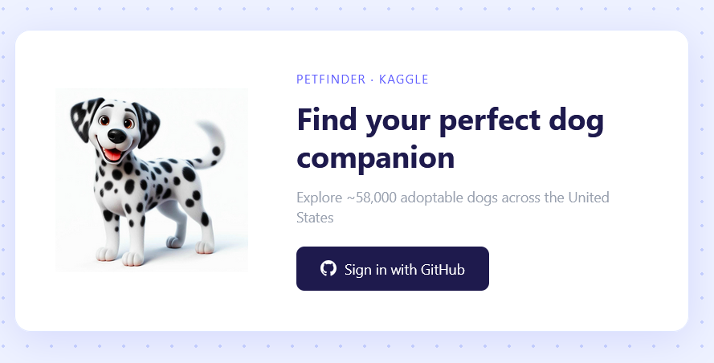
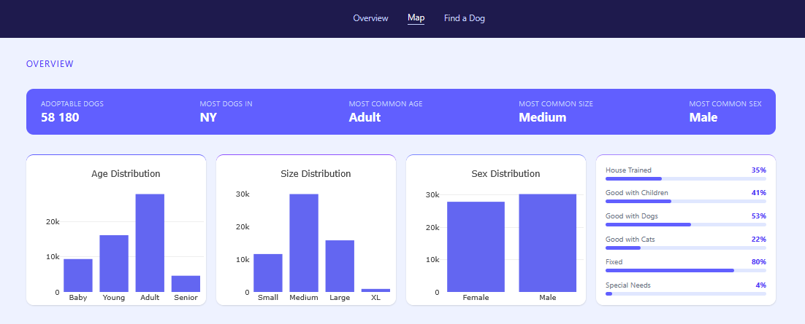
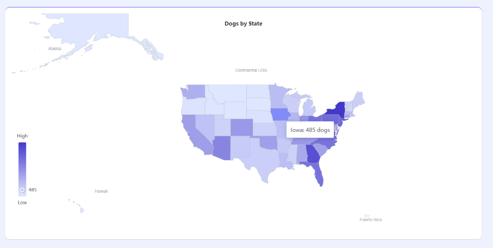
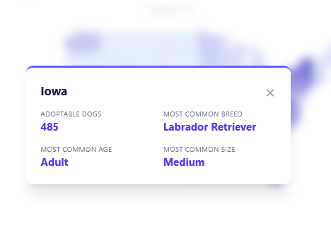
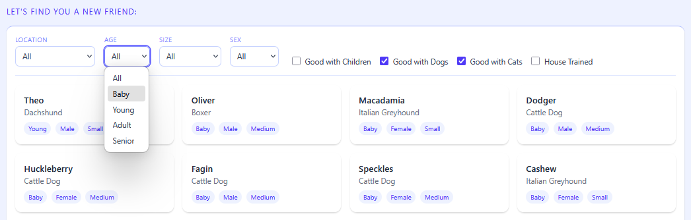
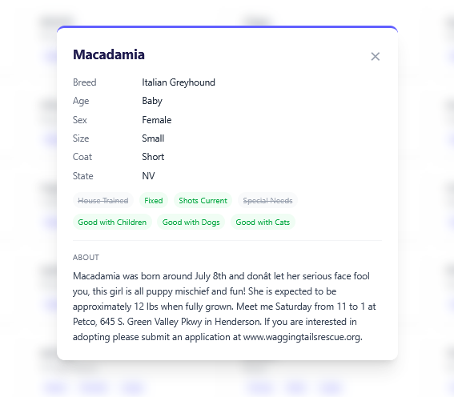

# 🐾 Dog Adoption Dashboard

[](https://nodejs.org/)
[](https://expressjs.com/)
[](https://vite.dev/)
[](https://www.mongodb.com/atlas)
[](https://www.docker.com/)
[](LICENSE)

> 📚 This project was developed as part of the course **1DV027 — Webben som applikationsplattform** at Linnaeus University (LNU).

An interactive data visualization dashboard for exploring ~58,000 adoptable dogs across the United States. Built with Vanilla JS, Vite, and an Express.js backend. Users authenticate via GitHub OAuth and can explore dog adoption patterns through charts, maps and filters.

**Live Application:** https://dog-adoption-dashboard.duckdns.org  
**Dog Adoption API (WT1):** https://dog-adoption-api.duckdns.org/api/v1

---

## Features

- GitHub OAuth 2.0 authentication — manual implementation without OAuth libraries
- Interactive choropleth map of dog distribution across US states
- Bar charts for age, size and sex distribution
- Statistics cards with boolean field percentages
- Paginated dog list with filters for location, age, size, sex and behavioral traits
- Dog detail modal with full profile and boolean badges
- Session-based authentication — JWT never exposed to the browser
- Pub/sub state management for reactive UI updates

---

## Screenshots

### Login


### Dashboard Overview


### Dashboard Map


### State Modal


### Find a Dog


### Dog Modal



---

## Tech Stack

| Layer | Technology | Purpose |
|---|---|---|
| Back-end | Node.js / Express | OAuth flow, session management, API proxy |
| Front-end | Vanilla JS + Vite | Component-based SPA without a framework |
| Styling | Tailwind CSS | Utility-first CSS |
| Visualization — charts | Plotly.js | Interactive bar charts |
| Visualization — map | Apache ECharts | Interactive choropleth map |
| Session store | connect-mongo | Persistent MongoDB-backed sessions |
| Security | Helmet, cors, express-rate-limit | Security headers, CORS, rate limiting |
| Deployment | Docker + nginx + DigitalOcean | Containerized production deployment with HTTPS |

---

## Architecture

The application uses a monorepo with two separate packages:

- **`backend/`** — Express.js server handling OAuth, session management and proxying to the Dog Adoption API
- **`frontend/`** — Vanilla JS + Vite SPA with component-based architecture

### Backend

Follows a layered architecture: `Router → Controller → Service → Client`, with a Composition Root in `ExpressApplication` that wires all dependencies. All classes use private fields and constructor injection.

### Frontend

Uses a pub/sub state module (`state.js`) for component communication, a client-side router (`router.js`) with lazy-loaded pages, and a centralized API module (`api.js`) for all backend communication.

---

## Getting Started

### Prerequisites

- Node.js v22+
- A MongoDB Atlas account
- A GitHub OAuth App

### Installation

```bash
git clone https://github.com/HannaRV/dog-adoption-dashboard.git
cd dog-adoption-dashboard
```

Install backend dependencies:
```bash
cd backend
npm install
```

Install frontend dependencies:
```bash
cd ../frontend
npm install
```

### Environment Variables

Create a `.env` file in `backend/` based on `.env.example`:

```env
PORT=3000
NODE_ENV=development
GITHUB_CLIENT_ID=your_github_client_id
GITHUB_CLIENT_SECRET=your_github_client_secret
GITHUB_CALLBACK_URL=http://localhost:3000/auth/github/callback
SESSION_SECRET=your_session_secret
CLIENT_URL=http://localhost:5173
DOG_API_URL=https://dog-adoption-api.duckdns.org/api/v1
MONGODB_URI=your_mongodb_connection_string
```

### GitHub OAuth App

1. Go to GitHub → Settings → Developer settings → OAuth Apps → New OAuth App
2. Set **Homepage URL** to `http://localhost:5173`
3. Set **Authorization callback URL** to `http://localhost:3000/auth/github/callback`
4. Copy Client ID and Client Secret to `.env`

### Run the Application

Start the backend:
```bash
cd backend
npm run dev
```

Start the frontend:
```bash
cd frontend
npm run dev
```

The application will be available at `http://localhost:5173`.

---

## Security

| Measure | Implementation |
|---|---|
| OAuth client secret | Never exposed to the browser — all OAuth communication is server-side |
| CSRF protection | State parameter verified on OAuth callback |
| Session security | `httpOnly`, `secure` in production, `sameSite: lax`, `session.regenerate()` after login |
| Session store | connect-mongo — persistent, not in-memory |
| Security headers | Helmet middleware |
| CORS | Configured for frontend origin only |
| Rate limiting | express-rate-limit — 100 requests per 15 minutes per IP |
| Secrets | Environment variables via `.env`, not committed to version control |
| Audit logging | Authentication events logged with timestamp, IP and user agent |
| Reverse proxy | nginx with HTTPS, `X-Forwarded-Proto` header |
| Firewall | UFW — port 3001 blocked externally |

---

## Deployment

The application is deployed on DigitalOcean using Docker and nginx:

```bash
# Build and run the backend container
docker build -t dog-adoption-dashboard .
docker run -d --name dog-adoption-dashboard --env-file .env -p 3001:3001 --restart unless-stopped dog-adoption-dashboard

# Build frontend and copy to nginx web root
npm run build
scp -r dist/* user@server:/var/www/dog-adoption-dashboard/
```

nginx serves the frontend static files and proxies `/api` and `/auth` to the Express backend.

---

## Acknowledgements

- Course examples and guidance by Oxana Lundström (LNU) and Alisa Lincke (LNU)
- Dataset: [Adoptable Dogs in the US — Kaggle](https://www.kaggle.com/datasets/thedevastator/adoptable-dogs-in-the-us)
- [Plotly.js documentation](https://plotly.com/javascript/)
- [Apache ECharts documentation](https://echarts.apache.org/en/index.html)

---

## Author

**Hanna Rubio Vretby**  
hr222sy@student.lnu.se  
Linnaeus University